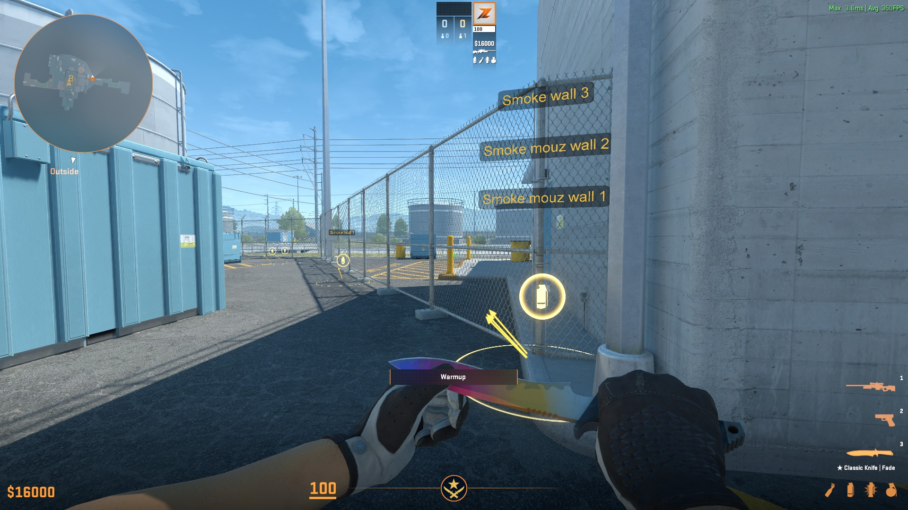
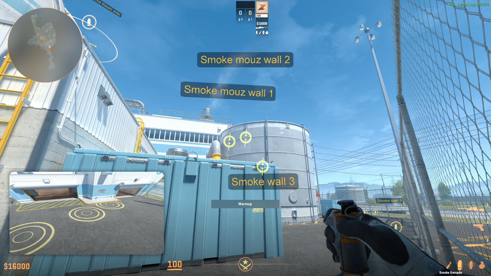

# CS2-Annotations

This repository contains utility lineups for Counter-Strike 2, using the built-in annotations feature.

|||
|---|---|
|| |

Annotations are to be placed in the following directory:

```text
C:\Program Files (x86)\Steam\steamapps\common\Counter-Strike Global Offensive\game\csgo\annotations
```

## Usage

### Using the zip file (recommended)

- Download the latest 'annotations.zip' file from the
  [releases page](https://github.com/ReneRebsdorf/CS2-annotations/releases)
- Extract the zip file to the csgo directory (path mentioned above), replace any files if prompted
- Start the game, select _practice_ in the top menu, choose a map, enable 'Load Map Guide' on the left, and click 'Go'
  to launch the server.
- Start a competitive practice game, the annotations will be loaded automatically

### Using git (advanced)

- Git clone this repository in the csgo directory
- Rename the directory from `CS2-annotations` to `annotations`
- Start the game, select _practice_ in the top menu, choose a map, enable 'Load Map Guide' on the left, and click 'Go'
  to launch the server.
- Start a competitive practice game, the annotations will be loaded automatically

## Creating annotations in-game

- Start the game with annotations enabled (see above or use sv_allow_annotations 1)
- Throw the lineup you want to create annotations for (this is important to record the destination target, whether it is
  a jump throw, etc.)
- Open the console and type `annotation_create grenade newLineup`
- Save the annotations with `annotation_save de_map-name`
- Open the annotation file in the annotations directory and copy the new annotations to this repository,
  or just use [git method described under 'Usage'](#using-git-advanced)
- Modify the 3 newest annotations (those in the bottom of the file), the following properties are useful to check:
  - For the first annotation (the position annotation):
    - `Color`: The color of the annotation, see [Color codes](#color-codes)
    - `Desc.Text`: A second line of text for the standing position, useful for advanced instructions
  - For the second annotation (the lineup/marker annotation):
    - `Desc.Text`: A second line of text for aiming instructions, useful for advanced lineups, and to instruct the type
      of throw, e.g. "Middle click, jump throw", make sure to remove the 'aim instructions'
  - For the third annotation (the destination annotation):
    - `DistanceThreshold`: The size of the target circle, useful for showing the accuracy needed for the lineup

## Annotation Commands

Annotations use the annotation\_\* commands in the console. Below are some useful commands:

- `annotation_create`: Creates a new lineup, described below. Omit parameters to get help text.
  The below commands can be used in combination to provide a more detailed lineup, with where to stand, where to aim,
  etc.
  - `annotation_create grenade text`: Creates a set of annotations with predefined values and uses a grenade icon with
    an arrow to help find the lineup. the text field becomes the name of the lineup. This also results in the lineup
    having a success-score, where after 2 successful throws, the help text and icons will disappear, and you will have to
    line it up yourself for 2 more successful throws. This is the recommended way to create lineups, but do note that the
    help text needs to be customized in the annotations file manually.
  - `annotation_create position "text"`: Adds a position on the map with the given text and displayed with a pair of
    boots
  - `annotation_create spot`: Creates two markers where you are looking to help you align your lineup.
  - `annotation_create text "free text" "extra text" float`: Creates a text floating in the air at where you are
    looking. Useful for providing additional information, such as what the lineup is for. the "extra text" parameter is
    optional, and provides a second line of text.
  - `annotation_create text "free text" "extra text" surface`: Similar to the above command, but the text is attached to
    a wall or similar
- `annotation_save <filename>`: Save the current annotations to a file, after doing so copy it back to this repository
- `annotation_reload`: Reload the annotations, useful when creating new annotations

## Color codes

It is possible to change the color of the annotations by modifying the `Color` field in the annotation file. The in-game
color codes are as follows:

- `white`: [ 255, 255, 255 ]
- `ct-blue`: [ 151, 201, 250 ]
- `t-yellow`: [ 234, 191, 86 ]

## Testing

The current tests are implemented using `pytest`. To run the tests it is recommended to create a virtual environment.

- Run `python -m venv .venv`
- Activate the virtual environment. Ie. with `./.venv/bin/Activate.ps1`, `./.venv/Scripts/Activate.ps1` or similar
- Run `pytest` or `pytest --verbose`. It will discover tests in the `tests` folder and execute all the discovered tests.

## Contributing

Contributions are warmly welcomed. Please create a pull request with your changes, and they will be reviewed as soon as
possible. The [issue tracker](https://github.com/ReneRebsdorf/CS2-annotations/issues) is also open for any suggestions
or bugs found.
